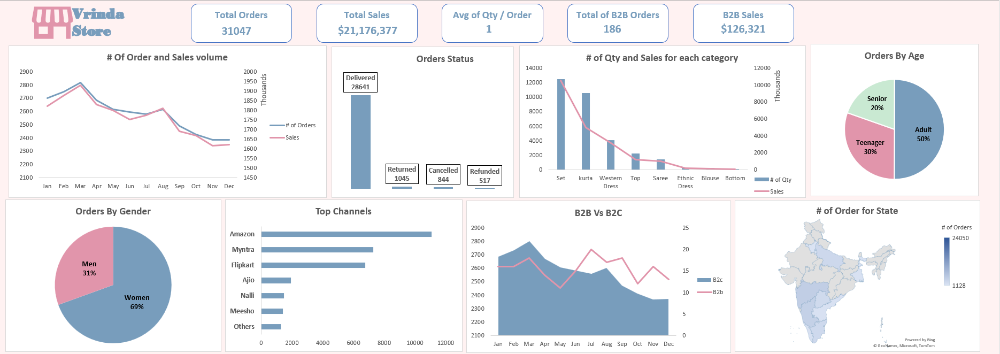

# Vrinda Store Sales Dashboard

## Overview
The Vrinda Store Sales Dashboard provides an insightful overview of key sales and order metrics, helping stakeholders track performance across various dimensions such as order status, gender, age, top sales channels, and more.

## Key Metrics 

### 1. **Total Orders and Sales**
   - **Total Orders:** 31,047
   - **Total Sales:** $21,176,377
   - **Average Quantity per Order:** 1
   - **Total B2B Orders:** 186
   - **B2B Sales:** $126,321

## Insights & Recommendations

### 1. **Increase Advertising Efforts**
   - The average quantity per order is currently at 1. More advertisements and promotions should be conducted to encourage bulk purchases.

### 2. **Top Sales Channels Performance**
   - Amazon is the leading sales channel, followed by Myntra and Flipkart. 

### 3. **Kurtas Category Performance**
   - While kurtas are frequently purchased, they do not contribute significantly to sales revenue. Consider pricing strategies or promotional offers to increase revenue.

### 4. **Best-Selling Product Category**
   - Sets have the highest sales volume and revenue. Ensuring stock availability and promoting similar products could drive further success.

### 5. **Regional Sales Insights**
   - Maharashtra is the top-performing state in terms of purchases. 

### 6. **Targeting Male Customers**
   - With 31% of customers being male, there is potential to increase male engagement. 

### 7. **B2C Performance in Mid-Year**
   - B2C sales performed exceptionally well in June and July.

### 8. **Declining B2B Sales**
   - B2B sales are showing a downward trend.
     

## **Contact**

For any questions or feedback, reach out via **[LinkedIn](https://www.linkedin.com/in/sondos-elsayed-a56787249/)** or email at **sunduselsayed@gmail.com**.

